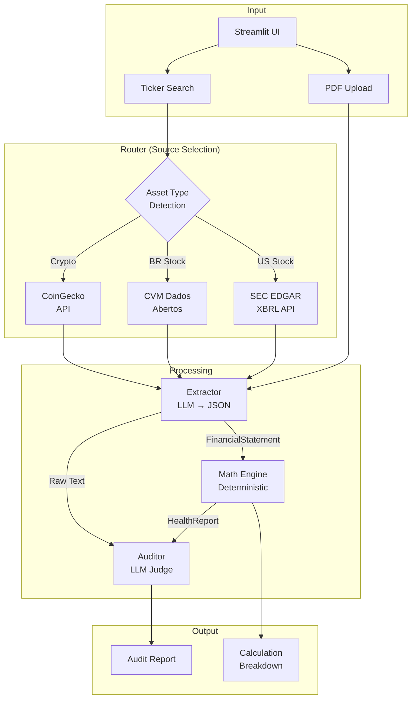
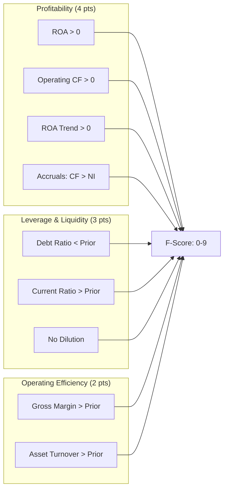

# Titan Financial Auditor

**Automated Financial Statement Analysis with LLM-Powered Forensic Auditing**

[](https://www.python.org/downloads/)
[](LICENSE)

*Read this in [Português (BR)](README.pt-BR.md)*

---

## Overview

Titan Auditor is a financial analysis system that combines deterministic mathematical models with Large Language Models to perform automated audits of public company filings. The system fetches official documents from regulatory sources (SEC EDGAR, CVM Dados Abertos), extracts structured data, computes standard financial indicators, and generates comprehensive audit reports.

**Key Capabilities:**
- Multi-region support: Brazilian (B3) and US (NYSE/NASDAQ) equities
- Direct integration with official data sources (no web scraping)
- Deterministic calculations with full formula transparency
- LLM-based narrative analysis comparing management claims vs. financial reality

---

## Architecture



### Component Responsibilities

| Module | Pattern | Description |
|--------|---------|-------------|
| `router.py` | Strategy | Detects asset type from ticker, selects appropriate data source |
| `extractor.py` | Adapter | Transforms unstructured text/XBRL into typed `FinancialStatement` |
| `calculator.py` | Strategy | Computes indicators using sector-specific formulas |
| `auditor.py` | Chain of Responsibility | Combines quantitative data with qualitative LLM analysis |

---

## Data Sources

| Region | Source | Document Type | Format |
|--------|--------|---------------|--------|
| Brazil | CVM Dados Abertos | ITR/DFP (Quarterly) | ZIP containing CSV |
| USA | SEC EDGAR | 10-Q/10-K | XBRL via JSON API |
| Global | CoinGecko | Market Data | REST API |

### CVM Integration Details

The system downloads quarterly ITR files from `dados.cvm.gov.br`, extracts consolidated financial statements (BPA, BPP, DRE), and maps CVM account codes to a unified schema:

| CVM Code | Field |
|----------|-------|
| 1 | `total_assets` |
| 1.01 | `current_assets` |
| 2.01 | `current_liabilities` |
| 2.03 | `equity` |
| 3.01 | `revenue` |
| 3.05 | `ebit` |
| 3.11 | `net_income` |

### SEC EDGAR Integration

Direct XBRL API calls to `data.sec.gov` using company CIK. No HTML parsing required. Supports automatic concept mapping for standard US GAAP fields.

---

## Financial Models

### Altman Z-Score (Bankruptcy Risk)

For non-financial companies in emerging markets, we use the Z'' model:

```
Z = 6.56(X1) + 3.26(X2) + 6.72(X3) + 1.05(X4)
```

Where:
- **X1** = Working Capital / Total Assets
- **X2** = Retained Earnings / Total Assets
- **X3** = EBIT / Total Assets
- **X4** = Book Value of Equity / Total Liabilities

**Classification Thresholds:**

| Z-Score | Zone | Interpretation |
|---------|------|----------------|
| > 2.6 | Safe | Low probability of distress |
| 1.1 – 2.6 | Grey | Elevated risk, requires monitoring |
| < 1.1 | Distress | High probability of bankruptcy |

### Piotroski F-Score (Financial Strength)

Nine binary criteria across three dimensions:



| Score | Signal |
|-------|--------|
| 7-9 | Strong fundamentals |
| 4-6 | Neutral |
| 0-3 | Weak fundamentals |

### DuPont Analysis (ROE Decomposition)

```
ROE = Net Margin × Asset Turnover × Financial Leverage
    = (NI/Rev) × (Rev/Assets) × (Assets/Equity)
```

Identifies whether returns are driven by operational efficiency, asset utilization, or leverage.

---

## Installation

### Requirements

- Python 3.10+
- API Key: OpenAI or xAI (Grok)

### Setup

```bash
git clone https://github.com/lipeamarok/titan-auditor.git
cd titan-auditor

python -m venv venv
# Windows
venv\Scripts\activate
# Unix/macOS
source venv/bin/activate

pip install -r requirements.txt
```

### Configuration

Create `.env` in the project root:

```env
OPENAI_API_KEY=sk-...
XAI_API_KEY=xai-...      # Optional
```

### Running

```bash
streamlit run app.py
```

Access at `http://localhost:8501`

---

## Usage

### Ticker Search

Enter a ticker symbol to fetch the latest filing:

| Market | Examples |
|--------|----------|
| Brazil (B3) | `PETR4`, `VALE3`, `ITUB4`, `MGLU3`, `AMER3` |
| USA (NYSE/NASDAQ) | `AAPL`, `MSFT`, `GOOGL`, `AMZN` |

The system automatically:
1. Identifies region from ticker pattern
2. Fetches official document (CVM/SEC)
3. Extracts structured financials
4. Computes all indicators
5. Generates audit report

### PDF Upload

Upload earnings releases or quarterly reports directly for analysis.

### Output Structure

| Section | Content |
|---------|---------|
| Verdict | `STRONG_BUY` / `BUY` / `HOLD` / `SELL` / `STRONG_SELL` |
| Executive Summary | Narrative vs. reality analysis (2 paragraphs) |
| Management Trust | Score 0-100 based on consistency of claims |
| Key Metrics | Z-Score, ROE, Leverage, Margins |
| F-Score Breakdown | 9 criteria with pass/fail status |
| Bull/Bear Cases | 3 arguments for each thesis |
| Calculation Audit | Step-by-step formula verification |

---

## Project Structure

```
titan-auditor/
├── app.py                 # Streamlit application entry point
├── ui.py                  # UI component library
├── prompts.py             # LLM system prompts
├── requirements.txt
├── .env                   # API keys (not committed)
│
├── core/
│   ├── router.py          # Data source routing logic
│   ├── extractor.py       # LLM-based data extraction
│   ├── calculator.py      # Deterministic financial calculations
│   ├── auditor.py         # LLM audit report generation
│   ├── market_data.py     # Yahoo Finance integration
│   └── market_map.py      # Ticker mappings
│
└── examples/              # Sample PDFs for testing
```

---

## Contributing

1. Fork the repository
2. Create a feature branch (`git checkout -b feature/new-feature`)
3. Commit changes (`git commit -m 'feat: add new feature'`)
4. Push to branch (`git push origin feature/new-feature`)
5. Open a Pull Request

---

## License

This project is licensed under the MIT License. See [LICENSE](LICENSE) for details.

---

## Disclaimer

This software is provided for **educational and informational purposes only**. It does not constitute investment advice. Always consult a qualified professional before making financial decisions. The developers assume no liability for losses resulting from the use of this tool.

---

**Author:** @lipeamarok
**Stack:** Python, Streamlit, OpenAI/xAI, SEC EDGAR, CVM
