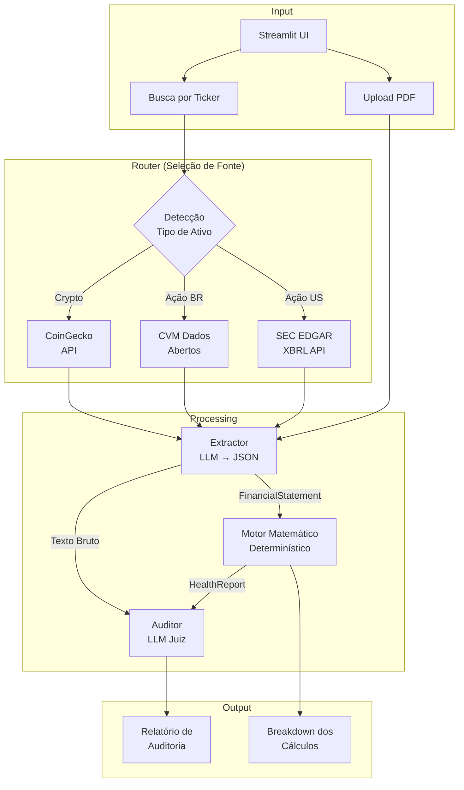
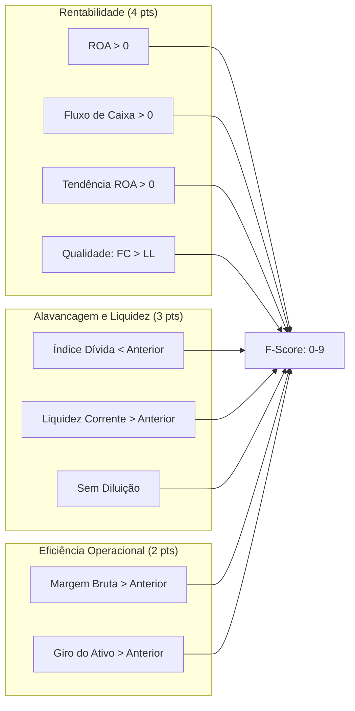

# Titan Financial Auditor

**Sistema de Auditoria Financeira Automatizada com Análise Forense via LLM**

[](https://www.python.org/downloads/)
[](LICENSE)

*Read this in [English](README.md)*

---

## Visão Geral

O Titan Auditor é um sistema de análise financeira que combina modelos matemáticos determinísticos com Large Language Models para realizar auditorias automatizadas de demonstrações financeiras de empresas públicas. O sistema busca documentos oficiais em fontes regulatórias (SEC EDGAR, CVM Dados Abertos), extrai dados estruturados, calcula indicadores financeiros padronizados e gera relatórios de auditoria completos.

**Principais Funcionalidades:**

- Suporte multi-região: ações brasileiras (B3) e americanas (NYSE/NASDAQ)
- Integração direta com fontes oficiais (sem web scraping)
- Cálculos determinísticos com total transparência das fórmulas
- Análise narrativa via LLM comparando discurso da gestão vs. realidade financeira

---

## Arquitetura



### Responsabilidades dos Componentes

| Módulo | Padrão | Descrição |
|--------|--------|-----------|
| `router.py` | Strategy | Detecta tipo de ativo pelo ticker, seleciona fonte de dados |
| `extractor.py` | Adapter | Transforma texto/XBRL não-estruturado em `FinancialStatement` tipado |
| `calculator.py` | Strategy | Calcula indicadores usando fórmulas específicas por setor |
| `auditor.py` | Chain of Responsibility | Combina dados quantitativos com análise qualitativa via LLM |

---

## Fontes de Dados

| Região | Fonte | Tipo de Documento | Formato |
|--------|-------|-------------------|---------|
| Brasil | CVM Dados Abertos | ITR/DFP (Trimestrais) | ZIP contendo CSV |
| EUA | SEC EDGAR | 10-Q/10-K | XBRL via JSON API |
| Global | CoinGecko | Market Data | REST API |

### Integração CVM

O sistema baixa arquivos ITR trimestrais de `dados.cvm.gov.br`, extrai demonstrações consolidadas (BPA, BPP, DRE) e mapeia códigos de conta CVM para schema unificado:

| Código CVM | Campo |
|------------|-------|
| 1 | `total_assets` |
| 1.01 | `current_assets` |
| 2.01 | `current_liabilities` |
| 2.03 | `equity` |
| 3.01 | `revenue` |
| 3.05 | `ebit` |
| 3.11 | `net_income` |

### Integração SEC EDGAR

Chamadas diretas à API XBRL em `data.sec.gov` usando CIK da empresa. Sem parsing de HTML. Suporta mapeamento automático de conceitos US GAAP.

---

## Modelos Financeiros

### Altman Z-Score (Risco de Falência)

Para empresas não-financeiras em mercados emergentes, utilizamos o modelo Z'':

```
Z = 6.56(X1) + 3.26(X2) + 6.72(X3) + 1.05(X4)
```

Onde:

- **X1** = Capital de Giro / Ativo Total
- **X2** = Lucros Acumulados / Ativo Total
- **X3** = EBIT / Ativo Total
- **X4** = Patrimônio Líquido / Passivo Total

**Thresholds de Classificação:**

| Z-Score | Zona | Interpretação |
|---------|------|---------------|
| > 2.6 | Segura | Baixa probabilidade de insolvência |
| 1.1 – 2.6 | Cinza | Risco elevado, requer monitoramento |
| < 1.1 | Perigo | Alta probabilidade de falência |

### Piotroski F-Score (Força Financeira)

Nove critérios binários em três dimensões:



| Score | Sinal |
|-------|-------|
| 7-9 | Fundamentos sólidos |
| 4-6 | Neutro |
| 0-3 | Fundamentos fracos |

### Análise DuPont (Decomposição do ROE)

```
ROE = Margem Líquida × Giro do Ativo × Alavancagem Financeira
    = (LL/Receita) × (Receita/Ativos) × (Ativos/PL)
```

Identifica se os retornos são gerados por eficiência operacional, utilização de ativos ou alavancagem.

---

## Instalação

### Requisitos

- Python 3.10+
- Chave de API: OpenAI ou xAI (Grok)

### Setup

```bash
git clone https://github.com/lipeamarok/titan-auditor.git
cd titan-auditor

python -m venv venv
# Windows
venv\Scripts\activate
# Unix/macOS
source venv/bin/activate

pip install -r requirements.txt
```

### Configuração

Crie `.env` na raiz do projeto:

```env
OPENAI_API_KEY=sk-...
XAI_API_KEY=xai-...      # Opcional
```

### Execução

```bash
streamlit run app.py
```

Acesse em `http://localhost:8501`

---

## Uso

### Busca por Ticker

Digite o ticker para buscar o último documento:

| Mercado | Exemplos |
|---------|----------|
| Brasil (B3) | `PETR4`, `VALE3`, `ITUB4`, `MGLU3`, `AMER3` |
| EUA (NYSE/NASDAQ) | `AAPL`, `MSFT`, `GOOGL`, `AMZN` |

O sistema automaticamente:

1. Identifica região pelo padrão do ticker
2. Busca documento oficial (CVM/SEC)
3. Extrai dados financeiros estruturados
4. Calcula todos os indicadores
5. Gera relatório de auditoria

### Upload de PDF

Aceita upload direto de earnings releases ou relatórios trimestrais.

### Estrutura do Output

| Seção | Conteúdo |
|-------|----------|
| Veredito | `STRONG_BUY` / `BUY` / `HOLD` / `SELL` / `STRONG_SELL` |
| Resumo Executivo | Análise narrativa vs. realidade (2 parágrafos) |
| Confiança na Gestão | Score 0-100 baseado em consistência |
| Métricas-Chave | Z-Score, ROE, Alavancagem, Margens |
| Breakdown F-Score | 9 critérios com status passa/falha |
| Teses Bull/Bear | 3 argumentos para cada lado |
| Auditoria de Cálculos | Verificação passo-a-passo das fórmulas |

---

## Estrutura do Projeto

```
titan-auditor/
├── app.py                 # Entry point da aplicação Streamlit
├── ui.py                  # Biblioteca de componentes UI
├── prompts.py             # System prompts para LLMs
├── requirements.txt
├── .env                   # Chaves de API (não commitado)
│
├── core/
│   ├── router.py          # Lógica de roteamento de fontes
│   ├── extractor.py       # Extração de dados via LLM
│   ├── calculator.py      # Cálculos financeiros determinísticos
│   ├── auditor.py         # Geração de relatório via LLM
│   ├── market_data.py     # Integração Yahoo Finance
│   └── market_map.py      # Mapeamentos de tickers
│
└── examples/              # PDFs de exemplo para testes
```

---

## Contribuindo

1. Fork o repositório
2. Crie uma branch de feature (`git checkout -b feature/nova-feature`)
3. Commit suas mudanças (`git commit -m 'feat: adiciona nova feature'`)
4. Push para a branch (`git push origin feature/nova-feature`)
5. Abra um Pull Request

---

## Licença

Este projeto está licenciado sob a Licença MIT. Veja [LICENSE](LICENSE) para detalhes.

---

## Disclaimer

Este software é fornecido **apenas para fins educacionais e informativos**. Não constitui recomendação de investimento. Sempre consulte um profissional qualificado antes de tomar decisões financeiras. Os desenvolvedores não se responsabilizam por perdas decorrentes do uso desta ferramenta.

---

**Autor:** @lipeamarok
**Stack:** Python, Streamlit, OpenAI/xAI, SEC EDGAR, CVM
